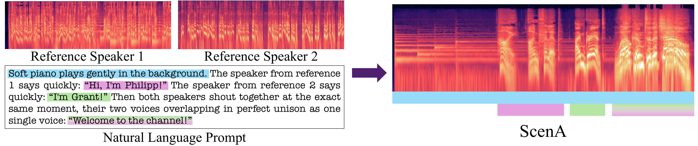

# ScenA — Reference-Driven Multi-Speaker Audio Scene Generation

**ScenA** generates multi-speaker audio *scenes* — dialogue and conversation with sound effects and
ambience — from a text prompt, conditioned on one or more **reference-audio** clips that set the speakers'
voices. It is an audio-only, reference-conditioned text-to-audio flow-matching DiT built on the LTX-2
architecture (~4B parameters).

<p align="center">
  📄 <a href="https://arxiv.org/abs/2606.19325">Paper</a> &nbsp;·&nbsp;
  🌐 <a href="https://finmickey.github.io/scena/">Project page &amp; samples</a> &nbsp;·&nbsp;
  🤗 <a href="https://huggingface.co/mifinkelson/scena">Model</a>
</p>

<p align="center">
  
</p>

## Install

```bash
git clone https://github.com/finmickey/scena
cd scena
uv sync           # or: pip install -e packages/ltx-core -e packages/ltx-pipelines
```

Requires a CUDA GPU.

## Download the models

Two files (~8.5 GB total) from the [Hugging Face model repo](https://huggingface.co/mifinkelson/scena):

```bash
huggingface-cli download mifinkelson/scena scena.safetensors audio_vae.safetensors --local-dir ./checkpoints
```

| file | contents |
|---|---|
| `scena.safetensors` | the ScenA transformer + Gemma text-projection weights |
| `audio_vae.safetensors` | the audio VAE + vocoder (bundled, so you don't need the full LTX-2 model) |

You also need the **Gemma-3-12B-IT** text encoder. It is **gated** — accept the license at
[`google/gemma-3-12b-it`](https://huggingface.co/google/gemma-3-12b-it) and authenticate
(`huggingface-cli login`), then:

```bash
huggingface-cli download google/gemma-3-12b-it --local-dir ./gemma-3-12b-it
```

## Quickstart

Two example reference voices ship in `examples/references/` — the same two voices drive both examples below:

```bash
python examples/generate.py --gemma-root ./gemma-3-12b-it --ckpt-dir ./checkpoints --out out.wav
```

Or from Python:

```python
from ltx_pipelines.t2aud_ref_cond import T2AudRefCondPipeline

pipe = T2AudRefCondPipeline(
    checkpoint_path="checkpoints/scena.safetensors",
    audio_vae_path="checkpoints/audio_vae.safetensors",
    gemma_root="./gemma-3-12b-it",
)

refs = ["examples/references/reference_1.wav", "examples/references/reference_2.wav"]

# A simple two-speaker dialogue
pipe(
    prompt='The speaker from reference 1 says: "The taxi drivers are on strike again." The speaker from reference 2 says: "What for?" The speaker from reference 1 says: "They want the government to reduce the price of the gasoline." The speaker from reference 2 says: "It is really a hot potato."',
    ref_audio_paths=refs,
    duration=7.0,
    seed=1,
).save("dialogue.wav")

# Farm at sunrise — the same two voices in a scene with sound effects
pipe(
    prompt='A farm at sunrise: a rooster crows. Chickens cluck softly throughout. The speaker from reference 1 says with a yawn: "Way too early for this." The speaker from reference 2 chuckles: "Welcome to country life." The rooster crows again.',
    ref_audio_paths=refs,
    duration=8.0,
    seed=1,
).save("farm.wav")
```

## Prompting guide

- Refer to speakers as **"the speaker from reference 1"**, **"reference 2"**, … matching the order of
  `ref_audio_paths`. (Space or underscore — `reference 1` / `reference_1` — both work equally well.)
- Put spoken words **in quotes**; describe sound effects and ambience in plain prose
  (e.g. *"a roaring stadium crowd cheers"*, *"rain drums steadily on a tin roof"*).
- Reference clips: clean single-speaker speech, up to ~20 s each — the more the better (any sample
  rate; mono or stereo).
- You don't have to follow a strict turn-taking pattern; see the
  [demo page](https://finmickey.github.io/scena/) for more varied examples.
- Defaults (60 steps, guidance ≈ 7) and output durations up to ~20 s work best — the model was trained
  on scenes ≤ 20 s.

## Repository layout

- `packages/ltx-core` — model, audio VAE/vocoder, text encoder, schedulers.
- `packages/ltx-pipelines` — the `T2AudRefCondPipeline` reference-conditioned pipeline.
- `examples/` — a runnable script and two bundled reference voices.
- `index.html`, `content/`, `static/` — the project page (served at finmickey.github.io/scena).

## Citation

```bibtex
@article{finkelson2026scena,
  title   = {Reference-Driven Multi-Speaker Audio Scene Generation from In-the-Wild Priors},
  author  = {Finkelson, Michael and Segal, Daniel and Richardson, Eitan and Armon, Shahar and Goldring, Nani and Panet, Poriya and Zabari, Nir and Brazowski, Benjamin and Patashnik, Or and HaCohen, Yoav},
  journal = {arXiv preprint arXiv:2606.19325},
  year    = {2026}
}
```

## License

Released under the [LTX-2 Community License](https://huggingface.co/Lightricks/LTX-2/blob/main/LICENSE).
